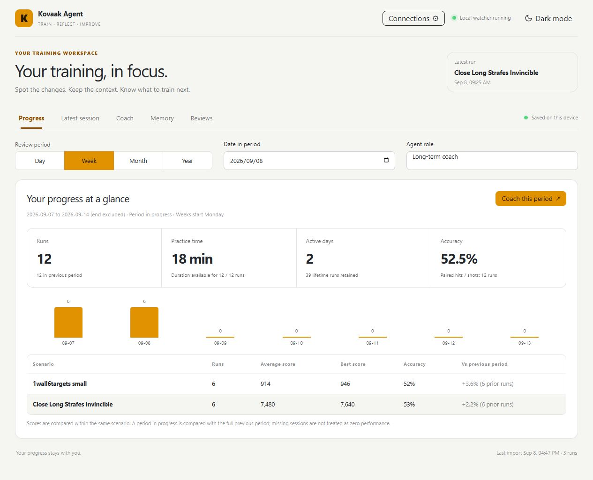
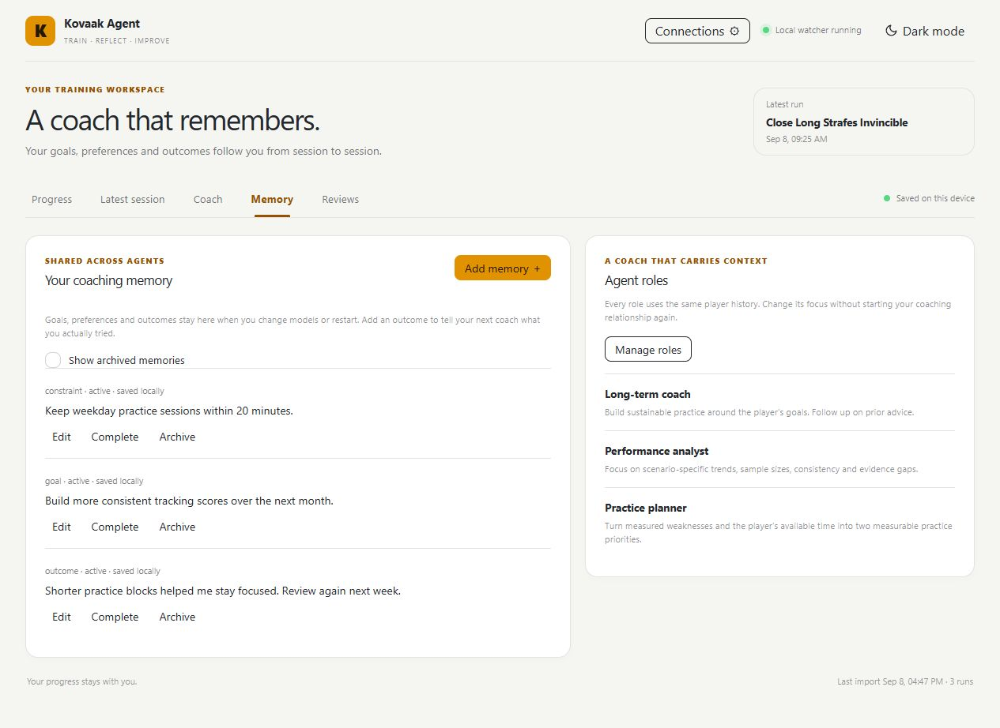
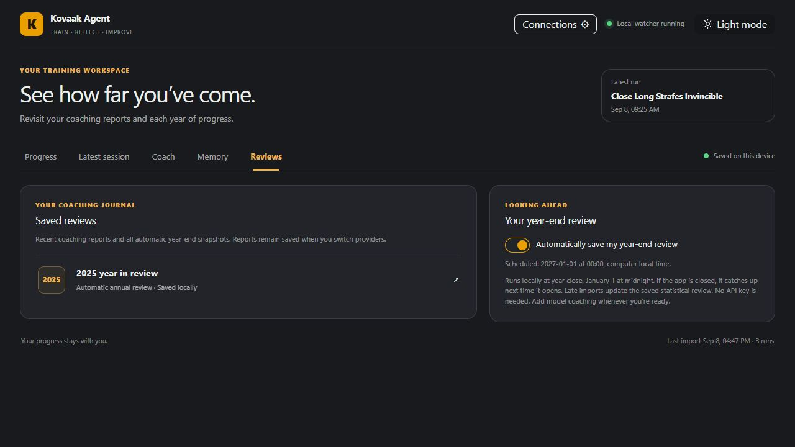

# Kovaak Agent

A local training dashboard that turns Kovaak's CSV exports into progress you can review and coaching you can continue across sessions, roles, and model providers.

**Status: 0.1.0 preview · MIT licensed.** Local workflows and request-security fixes have been tested. Live coaching remains unverified because no API credentials were available. See the [preview release notes](docs/release-notes-0.1.0.md), [validation report](docs/release-readiness.md), and [source file list](docs/release-files.txt).



*Actual application screenshots, captured using synthetic training records and example memories. They contain no personal training history or generated coaching claims.*

## Your training workspace

Five tabs keep everyday tasks separate. Connections, memory editing, role editing, and saved report readers open in dialogs. The interface uses bundled daisyUI components with orange accents, light and dark themes, and responsive layouts.

| Tab | What you can do |
| --- | --- |
| **Progress** | Review a day, Monday-start week, month, or calendar year; compare scores within each scenario; see practice time, active days, and accuracy. |
| **Latest session** | Inspect the latest imported run, recent exports, shot conversion, and settings when present in the CSV. |
| **Coach** | Choose a period and role, then request advice using your retained history, saved memories, and previous reports. |
| **Memory** | Add and edit goals, preferences, constraints, notes, and practice outcomes. Complete or archive memories, restore archived entries, and customize roles. |
| **Reviews** | Reopen saved coaching and automatic annual statistical reviews without another model call. |

## Quick start

You need **Python 3.11 or newer**, a modern browser, and a writable project folder. No Python packages, Node.js build, or Codex installation are required to run the app. This review tested Windows; other operating systems have not been verified.

1. Download and extract this repository, or clone it, then open a terminal in the folder containing `app`, `web`, and `run.ps1`.
2. Check your Python installation and start the server:

   ```powershell
   python --version
   python -m app.server
   ```

3. Open **http://127.0.0.1:8765** if the browser does not open automatically. Keep the terminal running; press **Ctrl+C** there to stop the app.
4. Open **Connections**, enter the path to your CSV file or stats folder, and choose **Save & scan**.

On Windows, `py -3 -m app.server` is an alternative if the Python launcher is installed. You can also use `./run.ps1`; it prefers an available bundled Codex Python runtime, then falls back to `python` or `py`. If PowerShell blocks that script, use the direct Python command above.

If port 8765 is occupied:

```powershell
python -m app.server --no-browser --port 8766
```

Then open `http://127.0.0.1:8766`.

### Try the included sample

In Connections, set the CSV path to `samples/demo-session.csv` when running from the project folder, or paste that file's absolute path. Choose **Save & scan**.

The sample contains **three runs dated August 30, 2026**. In Progress, select **Day** and set **Date in period** to **2026-08-30**. Current-day or current-week views may be empty because the sample has fixed historical dates. The screenshots above use an additional synthetic dataset, so their totals differ from the three-row sample.

### Find your Kovaak's exports

Locate the game installation through Steam's **Browse local files** action, then find its stats directory. A typical layout is:

```text
<SteamLibrary>/steamapps/common/FPSAimTrainer/FPSAimTrainer/stats
```

You can monitor a single CSV or a folder of per-run CSV files. The watcher checks for changes every two seconds and waits for a stable write before importing. Supported formats include row-based CSVs, key/value exports, and native multi-section Kovaak's stats. Native sections are combined into one run. Unsupported exports and missing metrics may need additional parser support.

## Coaching that carries context



Your player history, notes, roles, and saved reports live in SQLite on your computer. Switching between supported providers or roles reuses that shared evidence. Three editable roles are included: **Long-term coach**, **Performance analyst**, and **Practice planner**. You can create your own role with a name and instructions.

Save your available practice time and goals, then record an outcome after trying advice. Previous model prose remains prior advice; it is not automatically treated as a confirmed result. A different model may interpret the same evidence differently: continuity of stored context does not guarantee identical recommendations or better coaching outcomes.

Each coaching request includes deterministic statistics for the selected and previous periods, up to 40 scenario summaries, relevant lifetime scenario statistics through the selected period's end, up to 20 recent runs, 24 relevant memories, and five prior reports. Coverage counts identify omitted records. Saved reports retain their evidence packet and provider/model identity. The journal displays the latest 30 coaching reports and all annual reviews; older reports remain in the database and backup.

This is shared memory **inside this app**. A portable document library, document uploads, automatic sync between computers, and continuity in arbitrary external chat apps are not implemented.

## Connect a model

Importing, dashboards, memory editing, backups, and statistical annual reviews work without an API key. Model coaching and connection tests require internet access and your provider account; provider charges may apply.

In **Connections**, choose a provider, enter its API key, and choose a model available to your account. Keys entered here last for the running app process, not just the browser tab. Restarting the server clears them unless environment variables supply them again.

| Adapter | Configured default in this code | Request API |
| --- | --- | --- |
| OpenAI | `gpt-5.4-mini` | Responses, `/v1/responses` |
| OpenRouter | `~openai/gpt-latest` | Chat Completions, `/api/v1/chat/completions` |
| Google Gemini | `gemini-3.7-flash` | Interactions, `/v1beta/interactions` |

These are editable code defaults, not a guarantee of account access or continuing model availability. Automated provider tests use mocked responses; paid requests and end-to-end coaching with all three providers were not verified in the release review.

For optional environment configuration, choose **one** provider:

```powershell
$env:MODEL_PROVIDER = 'openai'
$env:OPENAI_API_KEY = 'your-key'
python -m app.server
```

For OpenRouter, use `MODEL_PROVIDER=openrouter` and `OPENROUTER_API_KEY`; for Gemini, use `MODEL_PROVIDER=gemini` and `GEMINI_API_KEY`. Optional model overrides are `OPENAI_MODEL`, `OPENROUTER_MODEL`, and `GEMINI_MODEL`. Saved settings take precedence over environment defaults. `KOVAAKS_CSV_PATH` supplies an initial source path. The app does not automatically load `.env` files.

Each provider keeps its own model and session key. Errors expose redacted diagnostics when available. Review your provider's handling of submitted data before sending personal notes.

## Annual reviews



Automatic annual statistical reviews are enabled by default and can be paused under **Reviews**. At **January 1, 00:00 in the computer's local time**, the app can save the completed year's review. Its worker checks once a minute while the app runs. If the app is closed, it catches up after the next launch. Earlier captured years are also reviewed; late imports refresh affected annual snapshots without duplicate yearly entries.

The app cannot wake the computer or run while closed. These reviews use local statistics and incur no model charge. Daily, weekly, and monthly views are available on demand; recurring model-generated reports for those periods are not scheduled. For model interpretation of a year, select that year in Coach and generate coaching separately.

## Retention, privacy, and backup

- Data is stored in `data/kovaaks-agent.db`, including source paths, normalized history, roles, notes, and reports. The `data/` directory is ignored by Git. Backups contain private data and are not encrypted by the app.
- Retained history survives source rewrites, truncation, deletion after capture, and app restarts. Imports commit atomically; failed captures remain retryable. Existing records migrate into the history store automatically.
- Native timestamped exports give the most reliable identity. Renamed/copied exports may count twice; separate identical runs without timestamps may be indistinguishable. Data lost before capture cannot be reconstructed without surviving exports or backups.
- Explicit-offset timestamps are converted to computer local time. Legacy timezone-free records keep their stored wall-clock meaning. Partial periods are compared with the full previous calendar period; missing sessions are not zero performance.
- Normalized statistics and selected memories/prior advice go to the chosen provider when coaching is requested. Raw CSV records and source-path metadata are excluded from that evidence packet. API keys are held in process memory, not intentionally saved to SQLite or logs.
- The server supports local loopback access only (`127.0.0.1` or `localhost`). It validates the local host and port, checks browser Origin/Referer/Fetch Metadata on reads and writes (including backups), and requires JSON for changes. It blocks framing and cross-origin resource use. These controls do not authenticate other local programs or users. Public hosting, tunnels, and reverse proxies are unsupported. See the [request-security details](docs/release-readiness.md#request-security-fix).

Choose **Download backup** in Connections to download a consistent SQLite snapshot, including committed data in the write-ahead log. Keep a copy separately from your computer.

To restore, stop all app instances, move the existing `data` folder aside as a safety copy, create a new `data` folder, and place the downloaded file there as `kovaaks-agent.db`. Restart the app. Keep the old folder's files together; do not mix old `-wal` or `-shm` files with the restored database. There is no in-app restore, complete profile deletion, or portable memory document import workflow yet.

## Development and verification

```powershell
python -m unittest discover -s tests -v
```

For frontend contributors, `node --check web/app.js` checks JavaScript syntax; Node is only needed for that optional development check. The UI is served directly from `web/`, with bundled CSS and no build step.

Fresh validation on **September 9, 2026**: **37 automated tests passed**, including request-security regressions and backup restore. The same suite passed in a separate copy built only from the release file list, with Python site packages disabled. JavaScript syntax and whitespace checks passed. Browser checks verified all five tabs, sample import, memory saving and reload persistence, period selection, and backup download with the new protections enabled. Existing screenshots remain accurate because the UI did not change. Provider handoff tests use mocks; no API credentials were available for live calls. Coaching-quality evaluation and other operating systems remain unverified. Full evidence and publication scope are in the [release review](docs/release-readiness.md).

The main modules are `app/importer.py` (CSV normalization), `database.py` (storage), `watcher.py` (capture), `memory.py` (history and coaching context), `model.py` (providers), `service.py` (coordination), and `server.py` (local HTTP API).

## License and attribution

This project is licensed under the [MIT License](LICENSE), copyright 2026 Kovaak Agent contributors. The bundled daisyUI stylesheet retains its own MIT copyright notice; see [third-party notices](THIRD_PARTY_NOTICES.md).
